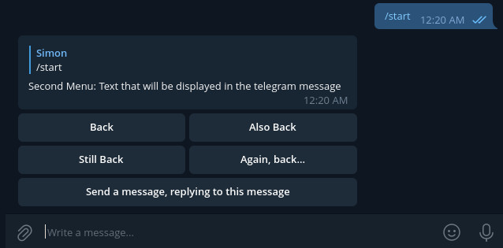

# Telegram Menu Library

### A library for making menus for your telegram bots!


## Get it from Maven

```xml
<dependency>
    <groupId>org.simonscode</groupId>
    <artifactId>telegram-menu-library</artifactId>
    <version>2.0</version>
</dependency>
```

## Usage

### 1. Create a menu:

```java
SimpleMenu myMenu = new SimpleMenu("Menu Title");
```

### 2. Add buttons to it

There are three types of buttons:

| Class          | Function              |
|----------------|-----------------------|
| CallbackButton | Running any Java code |
| URLButton      | Go to URLs            |
| GotoButton     | Go to other menus     |

#### CallbackButton

You can create a `Callback` which takes a `CallbackFunction` as parameter.
The `CallbackFunction` can contain any Java code.
It will be executed when the button is pressed.

```java
myMenu.addButton(new CallbackButton("Callback Button", new Callback((bot, callbackQuery, parameters) -> {
    System.out.println("This code will execute when the button is clicked");
})));
```

#### GotoButton

This button will replace the message and the buttons below it with the message and buttons of the `myOtherMenu`.
You can use this to navigate between menus.

```java
myMenu.addButton(new GotoButton("Back", myOtherMenu));
```

#### URLButton

A button that allows points to a Website.

```java
myMenu.addButton(new URLButton("URL Button", "https://www.simonscode.org/"));
```

### Button Placement

By default, all buttons are going to be put in the same row.
If you want to put a button in the row below, then you have to call `.nextRow()` before adding the button.

```java
myMenu.addButton(new CallbackButton("Top Left",new NullCallback()));
myMenu.addButton(new CallbackButton("Top Right",new NullCallback()));
myMenu.nextRow();
myMenu.addButton(new CallbackButton("Bottom",new NullCallback()));
```

### 3. Send the first menu to telegram

You can generate a new message from the menu and send it to any chat.

```java
SendMessage sendMessage = myMenu.generateSendMessage();
sendMessage.setChatId(update.getMessage().getChatId());
bot.execute(sendMessage);
```

### 4. Starting the bot

Before handling any update, you should call this function.
It is responsible for replying with menus and executing callbacks.

The function will return a boolean. If the update was handled, then it will be true.

```java
@Override
public void onUpdateReceived(Update update){
    if (UpdateHook.onUpdateReceived(this,update)) {
        // update has been taken care of
    } else {
        // update is a command or anything not relating to menus
    }
}
```

### 5. (optional) Removing the menu

When the menu isn't needed anymore, it can be discarded like this:

```java
myMenu.unregister(true);
```

True or false specifies, if the menus it points to should also be discarded.

You should only need to delete menus when you create new menus regularly.

## A full example

The code is also in the file [ReadmeCode.java](src/test/java/org/simonscode/telegrammenulibrary/ReadmeCode.java)

```java
SimpleMenu firstMenu = new SimpleMenu("Example Menu Title");
SimpleMenu secondMenu = new SimpleMenu("Second Menu: Text that will be displayed in the telegram message");

// Add buttons to the first menu
firstMenu.addButton(new CallbackButton("Callback Button", new Callback((bot, callbackQuery, parameters) -> {
    System.out.println("This code will execute when the button is clicked");
})));

// Put the following buttons in the next row, otherwise buttons will be laid out horizontally
firstMenu.nextRow();

// Buttons also allow you to go to other menus.
// That way, you can create a tree of submenus. Check the RecipeExample for a nesting example.
firstMenu.addButton(new GotoButton("Go to Second Menu", secondMenu));

// You can also chain the functions together, since each returns the menu.

// Laying the buttons out in this shape:
//
//  +-------+-------+
//  |   1   |   2   |
//  +-------+-------+
//  |   3   |   4   |
//  +-------+-------+
//  |       5       |
//  +---------------+

secondMenu
        .addButton(new GotoButton("Back",firstMenu))
        .addButton(new GotoButton("Also Back",firstMenu))
        .nextRow()
        .addButton(new GotoButton("Still Back",firstMenu))
        .addButton(new GotoButton("Again, back...",firstMenu))
        .nextRow()
        .addButton(new CallbackButton("Send a message, replying to this message", new Callback((bot, callbackQuery, parameters) -> {
            SendMessage reply = new SendMessage(callbackQuery.getMessage().getChatId().toString(), "This is a reply message");
            reply.setReplyToMessageId(callbackQuery.getMessage().getMessageId());
            bot.execute(reply);
        })));


// Run the test bot with the first menu.
TestBot.startBotWithMenu(firstMenu);
```



## Callback Parameters

You don't have to create a different callback for changing a parameter.

You can add the same callback with different parameters like this:
```java
myMenu.addButton(new CallbackButton("Small", TwoSubmenus::setMessageText, "Small"))
myMenu.addButton(new CallbackButton("buttons", TwoSubmenus::setMessageText, "buttons"))
myMenu.addButton(new CallbackButton("in", TwoSubmenus::setMessageText, "in"))
myMenu.addButton(new CallbackButton("one", TwoSubmenus::setMessageText, "one"))
myMenu.addButton(new CallbackButton("row.", TwoSubmenus::setMessageText, "row."));
```

All these buttons execute the same callback function `TwoSubmenus::setMessageText`.

The full example is in the file [TwoSubmenus.java](src/test/java/org/simonscode/telegrammenulibrary/TwoSubmenus.java)

## Important info

The order that you create menus is important!

If you restart the bot and swap the order in which you construct the menus and callbacks,
then your old menus might not link to the right places anymore.

There is also the `HorizontalMenu` and `VerticalMenu`, which organize the buttons in a row and column respectively.

## Examples

 - [ReadmeCode.java](src/test/java/org/simonscode/telegrammenulibrary/ReadmeCode.java) contains the example from above
 - [RecipeExample.java](src/test/java/org/simonscode/telegrammenulibrary/RecipeExample.java) shows how unregistering menus works
 - [TwoSubmenus.java](src/test/java/org/simonscode/telegrammenulibrary/TwoSubmenus.java) demonstrates two submenus with 
